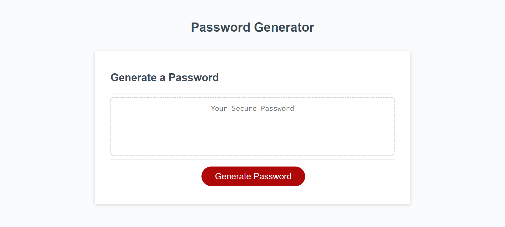

# Description

## JavaScript

JAVASCRIPT OVERVIEW

For the JavaScript file, I started out by creating a string for the upper and lower case letters, numbers, and symbols. Next I created a function that makes prompts appear and the users chooses answers that determine what characters the random password will contain. Next, I created a function that connected the user's answers to the computer. I did this by creating if statements. If their answer was a positive boolean, the generator would include the selected option, if their answer was a negative boolean, the generator would not include that option.

HTML OVERVIEW

For the HTML file, I changed all of the div tags.

## Link to Deployed Website

https://hstor3.github.io/prompt_pass_generator/

## Screenshot

